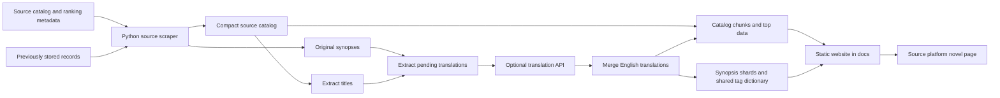

# NovelDB metadata pipeline

This document describes the repository as inspected on **2026-09-13**. NovelDB is a static search interface for novel metadata: readers find a title, inspect its description and attributes, and follow a link to the source platform. The metadata site and the desktop novel downloader share this repository, but their collection and delivery paths are separate.

The initial review used source and local artifact inspection. Subsequent implementation added Naver, Munpia and Joara using bounded anonymous samples, offline tests and a local fixture browser. No account login, authenticated batch file, desktop downloader, translation API or publishing workflow was run. All 457 existing production data files remained unchanged. The original-source snapshot below remains distinct from the new staged samples.

- [Current system and collection behavior](#1-current-system-and-data-flow)
- [Storage and data contracts](#2-storage-and-browser-data-contracts)
- [Browser loading, search and filters](#3-how-the-browser-uses-the-metadata)
- [Complete script inventory](#4-complete-scripts-inventory)
- [Root entrypoints](#5-root-entrypoints-and-desktop-boundaries)
- [GitHub Actions automation](#6-github-actions-automation)
- [Extension observations](#7-observations-relevant-to-adding-metadata-sources)

## 1. Current system and data flow

The published local catalogs are Novelpia and KakaoPage in Korean, and SFACG in Chinese. Naver Web Novel, Munpia and Joara now have metadata adapters and complete pipeline integration, but their implementation samples remain in ignored staging. Their selector options stay unavailable until manifests are published; see the [new-source integration guide](metadata-source-expansion.md).

| Source | Local catalog | Rows / unique source IDs | Rows tagged `deleted` | Catalog chunks |
| --- | --- | ---: | ---: | ---: |
| Novelpia | [novels.json](data/novels.json) | 92,267 | 10,358 | 5 |
| KakaoPage | [kakao_novels.json](data/kakao_novels.json) | 70,164 | 214 | 3 |
| SFACG | [sfacg_novels.json](data/sfacg_novels.json) | 280,833 | 6,983 | 10 |

Total: **443,264 source records**, without deduplication of works across platforms.

These are the local snapshot counts on the review date, including retained historical records. They are not counts of currently purchasable works. Each catalog manifest agrees with its local catalog count and has `embedded: true`. Read-only decoding of all 18 catalog chunks verified that their concatenated `novels` arrays exactly match the corresponding raw catalogs. Every current chunk contains `novels` and `translations`; embedded English-title counts are 92,007 for Novelpia, 65,367 for KakaoPage, and 277,793 for SFACG. These are artifact consistency checks, not live-source coverage tests.



The reusable build tools operate on local data. A source scraper discovers records and merges them with previous metadata; translation is a later optional step. The browser receives compressed catalog chunks, small top-ranking bundles where available, and on-demand synopsis shards. It does not run Python scrapers. References: [catalog chunk builder](../scripts/chunk_and_compress.py), [synopsis shard builder](../scripts/chunk_descriptions.py), [website application](app.js).

### Source collection boundaries

| Source path | Collection and retention behavior | Authentication boundary |
| --- | --- | --- |
| [scrape_npia.py](../scripts/scrape_npia.py) | Broad tag/character searches, rankings, compact catalog and full metadata objects; preserves previously stored compact-catalog IDs. Used by the local authenticated batch file. | Always reads root `config.json` and passes its `loginkey` value to `NovelpiaAuth.set_manual_key`. It does not call the email/password login method. |
| [rescrape_npia_noauth.py](../scripts/rescrape_npia_noauth.py) | Scheduled full update using public search results; updates found records, appends new IDs, retains missing IDs and old-only full synopsis records. | Uses a plain `requests.Session`; no configured account login. Its `--dry-run` still performs remote scraping and only disables final writes. |
| [scrape_kakao.py](../scripts/scrape_kakao.py) | Public BFF genre catalog by default, explicit alternative search mode, and synopsis collection; merges prior records before export. | Uses HTTP requests, not a logged-in browser. |
| [scrape_sfacg.py](../scripts/scrape_sfacg.py) | Catalog passes and broad type/length buckets, public mobile rankings, synopsis and latest-chapter metadata; merges prior records before export. | Uses the application's API request headers; this is distinct from a personal account login. |

For Novelpia's scheduled full update, search defaults are four workers, four attempts per page, and a 0.5-second submission stagger. Each term allows up to 20 pages of 30,000 results. Search terms and retry status codes live in [novelpia_search_terms.py](../novelpia_search_terms.py). Rankings cover all/adult/teen audiences across weekly/monthly/daily periods. Empty ranking results preserve that audience's existing rankings. The ranking-only updater additionally fails when required all/teen rankings cannot be obtained. References: [full updater](../scripts/rescrape_npia_noauth.py), [ranking updater](../scripts/update_rankings_noauth.py).

Missing search results are not independently verified removals. The scheduled Novelpia updater retains missing R19 records without newly marking them deleted; missing non-R19 records can acquire the `deleted` tag. It suppresses new deletion tagging if more than 20% of at least 1,000 live non-R19 records are missing. That guard does not prevent the rest of the metadata/ranking update. Freshly found records replace their tag lists and can therefore lose a previous `deleted` tag.

### How each source is collected

**Novelpia.** Both full scrapers query `https://novelpia.com/proc/novel` with `cmd=novel_search`, first for shared tags and then for a character sweep. A short result page ends a term; the page cap also bounds discovery. Results are deduplicated by stringified novel ID, with the first fresh discovery winning. This is broad search-based discovery, not proof of exhaustive enumeration. Search responses supply the original title, author nickname, synopsis, tags, cover URL, views, likes, chapter count, completion, age and update value. Separate top-100 HTML pages supply ranking positions from their `/novel/{id}` links. The compact export omits the synopsis; the full object file retains it for extraction. A previously known real cover is preserved when a fresh response supplies an empty or placeholder cover. See [authenticated scraper](../scripts/scrape_npia.py) and [public scraper](../scripts/rescrape_npia_noauth.py).

**KakaoPage.** [scrape_kakao.py](../scripts/scrape_kakao.py) defaults to the public genre BFF at `https://bff-page.kakao.com/api/gateway/view/v1/landing/genre`, with category `11`, screen `84` and latest-product sorting. The first response's `total_count` and page size establish the remaining page requests; `is_end` marks completion. Parallel workers use separate HTTP sessions. The retry helper handles transient statuses and connection errors with numeric `Retry-After` support or exponential backoff. `--source search` instead sweeps fourteen Hangul terms through the search BFF; it is not an automatic recovery path if genre collection fails.

Kakao metadata includes title, author(s), category tag, cover, views, completion, update value and age. Completion is inferred from the source's status/on-issue fields or a completion marker in the title. Likes and chapter count are zero placeholders in this scraper. Missing synopses are requested from `https://bff-page.kakao.com/api/gateway/api/v2/content/product/list` with `window_size=0`, reading `result.series_item.description`; no episode bodies are collected. Existing nonempty original descriptions act as a cache and are not routinely refreshed. The writer preserves existing English descriptions, excluding values that still contain CJK text.

**SFACG.** [scrape_sfacg.py](../scripts/scrape_sfacg.py) starts with a dense `/novels` catalog sweep ordered by ID, fifty rows per page, then supplements discovery with source type/category buckets, character-count ranges and `latest`/`viewtimes` sort passes. Returned type IDs are supplemented by configured fallback categories. Five public mobile ranking categories provide up to twenty IDs each. Later broad-pass results replace earlier fresh records with the same ID. Periodic autosaves already merge historical records and write the main catalog; they disable new deletion tagging. Ranked works missing synopses receive further metadata lookups using their type and character-count context.

SFACG responses supply synopsis and latest-chapter title/ID/time as metadata. The exporter stores `markCount` as its common `likes` field and `charCount` as its common `chapters` field. Its `age=19` comes from `allowDown == 0`, rather than an explicit upstream age rating. The app-level request authorization header is defined in source and is not a user-account login; its value is intentionally not reproduced here. No chapter viewer or episode-body retrieval is part of this catalog flow.

### Historical records and deletion inference

| Collector | What survives an absent discovery result | When a new `deleted` tag is added |
| --- | --- | --- |
| Authenticated Novelpia | Previous compact rows and their corresponding or reconstructed full metadata | Missing non-R19 rows; no partial-coverage guard in this path |
| Public Novelpia | Previous compact rows and all old-only full metadata objects | Missing non-R19 rows, unless more than 20% of a baseline of at least 1,000 live non-R19 rows is missing |
| KakaoPage | All previous catalog records; fresh records replace matching IDs | Missing rows, including after a limited/partial run; no internal coverage guard |
| SFACG | All previous catalog records; fresh records replace matching IDs | Missing rows, unless more than 20% of at least 1,000 live rows is missing; autosaves suppress new tags |

Authenticated Novelpia's retention loop is driven by the old compact catalog: a record found only in the old full object file is not independently retained by that scraper. The public scraper explicitly preserves old-only full objects. These details matter because historical titles and synopses help readers identify works that have moved.

[guard_catalog_drop.py](../scripts/guard_catalog_drop.py) compares row counts against a Git revision. Because the collectors preserve rows, widespread false `deleted` tags can leave the row count unchanged and pass this guard. The tag therefore remains an observation about discovery, not confirmed source deletion. No existing deletion rules were changed in this documentation task.

### Authentication and run controls

- [rescrape_auth.bat](../rescrape_auth.bat) invokes the account-session Novelpia scraper directly and does not forward command-line arguments. Appending `--no-auth` to this batch file does nothing to disable authentication. The scraper has no no-auth or dry-run option.
- [rescrape_npia_noauth.py](../scripts/rescrape_npia_noauth.py) uses fresh public HTTP sessions without opening the account configuration. Its `--dry-run` is a full network scrape followed by a return before saving, not a bounded sample or offline check.
- [update_rankings_noauth.py](../scripts/update_rankings_noauth.py) uses `NovelpiaAuth()` to create a generated session key without username/password login. Its name does not mean it avoids all session material. The separate [update_rankings.py](../scripts/update_rankings.py) uses the configured account-session key.
- Kakao's `--max-pages` and SFACG's `--max-pages` limit collection but still write the production catalog. SFACG can write autosaves before the final export. Neither flag is a substitute for an output-directory or no-write mode.

These distinctions were established by reading code. No configuration credential values or saved browser sessions were opened, and none of these entrypoints was run.

## 2. Storage and browser data contracts

### Compact catalog arrays

Catalog JSON files contain arrays of positional arrays, not objects with named fields. Indices after 9 are source-specific. A missing trailing field is normal for SFACG and must be read with a fallback.

| Index | Novelpia | KakaoPage | SFACG |
| ---: | --- | --- | --- |
| 0 | Source novel ID | Source series ID | Source novel ID |
| 1 | Original title | Original title | Original title |
| 2 | Author | Author | Author |
| 3 | Cover URL/path | Cover URL | Cover URL/path |
| 4 | Tags | Tags | Tags; broad genre/type is used for bucket lookup |
| 5 | Views | Views/read count as supplied | Views/hits |
| 6 | Likes | Likes field; current discovery uses zero | Bookmark count (`markCount`), stored as `likes` |
| 7 | Chapter count | Chapter-count field; current discovery uses zero | **Character count**, stored under the internal name `chapters` |
| 8 | Completion flag | Completion flag | Completion flag |
| 9 | Update value from source | Update value from source | Update value from source |
| 10 | Weekly rank, all audience | Zero weekly-rank placeholder | Age heuristic: `allowDown == 0` becomes `19` |
| 11 | Age rating | Age rating | Popularity rank |
| 12 | Monthly rank, all audience | Not emitted | Best-seller rank |
| 13 | Daily rank, all audience | Not emitted | New-books rank |
| 14 | Weekly rank, adult | Not emitted | Bookmarks rank |
| 15 | Monthly rank, adult | Not emitted | JP light-novel rank |
| 16 | Daily rank, adult | Not emitted | Ticket-rank slot |
| 17 | Weekly rank, teen | Not emitted | Synopsis before extraction; normally cleared afterward |
| 18 | Monthly rank, teen | Not emitted | Latest chapter title |
| 19 | Daily rank, teen | Not emitted | Latest chapter ID |
| 20 | Not emitted | Legacy embedded synopsis accepted by extractor, not emitted by current scraper | Latest chapter time |

The current snapshot has 20 fields for every Novelpia row and 12 for every Kakao row. SFACG has 280,811 rows with 21 fields, 14 with 11, and eight with 10. Export code trims trailing zero, empty-string, and empty-list values for SFACG. See [Novelpia export](../scripts/scrape_npia.py), [Kakao `save_novels`](../scripts/scrape_kakao.py), [SFACG export](../scripts/scrape_sfacg.py), and [description extraction](../scripts/extract_sfacg_descriptions.py).

Rank zero means unranked/unavailable in these formats; it does not establish the reason. The SFACG ranking updater currently collects five categories and writes zero to the ticket slot because it does not request a ticket category. Counts and update fields retain source semantics: they are not interchangeable measurements across platforms.

Novelpia also has `docs/data/novels_full.json`, an object-array working file containing `id`, `title`, `synopsis`, `author`, `cover`, `tags`, `views`, `likes`, `chapters`, `complete`, `age`, and `updated`. It feeds synopsis extraction and preservation utilities. This file is ignored by Git and is not the compact browser catalog or a guaranteed file in a clean checkout. Do not infer source IDs are globally unique: the current separation is by catalog/corpus file.

### Translation and synopsis corpora

Title and synopsis files use UTF-8 with one logical record per physical line:

```text
source_id|||original text|||English translation
```

An empty third column means pending translation. Synopsis newlines are encoded as the two literal characters `\n`; consumers restore them for display. Translated rows are generally written before pending rows. File naming is explicit:

| Source | Title corpus | Pending titles | Synopsis corpus | Pending synopses |
| --- | --- | --- | --- | --- |
| Novelpia | `titles_en.txt` | `titles_untranslated.txt` | `descriptions.txt` | `descriptions_untranslated.txt` |
| KakaoPage | `kakao_titles_en.txt` | `kakao_titles_untranslated.txt` | `kakao_descriptions.txt` | `kakao_descriptions_untranslated.txt` |
| SFACG | `sfacg_titles_en.txt` | `sfacg_titles_untranslated.txt` | `sfacg_descriptions.txt` | `sfacg_descriptions_untranslated.txt` |

All these files are under `docs/data/`; synopsis `.gz` copies are also produced. Several tools accept a gzip fallback. SFACG workflows commit the compressed synopsis corpus, so a clean checkout can have only that version. The synopsis shard builder prefers whichever existing text/gzip corpus is newer; not every other reader makes that comparison.

The shared tag dictionary differs from the translation job's patch format:

```text
# Persistent tags_en.txt and tags_en.txt.gz, without this comment:
original tag|||English tag

# Temporary tags_untranslated.txt or sfacg_tags_untranslated.txt:
temporary_numeric_id|||original tag|||English tag
```

Tag patch IDs are temporary sequence numbers; the durable dictionary key is original tag text. [Tag merging](../scripts/merge_translated_tags.py) keeps existing translations and adds only previously unknown tags. [Novelpia tag extraction](../scripts/extract_untranslated_tags.py) and [SFACG tag extraction](../scripts/extract_untranslated_sfacg_tags.py) also consult the legacy `TAG_MAP` in [app.js](app.js).

English-validation and delimiter handling differ between scripts. Shared chunk/translation tools require an ASCII letter and reject CJK characters in the English column; older Novelpia merge paths are more permissive. Several older readers split on every delimiter, whereas newer builders split the first and last delimiter to tolerate delimiters in original text. Novelpia synopsis extraction replaces literal `|||` with fullwidth equivalents. This is an existing compatibility constraint for new adapters, not a single shared parser implementation.

### Compressed catalogs, synopsis shards, and top bundles

[chunk_and_compress.py](../scripts/chunk_and_compress.py) accepts any JSON array whose row ID is at index 0. It divides rows into approximately equal sequential chunks. With `--translations` or `--descriptions`, a chunk has this shape:

```json
{
  "novels": [[123, "original title", "author"]],
  "translations": {"123": "English title"},
  "descriptions": {"123": "English or original synopsis"}
}
```

The example row is abbreviated, not a complete source schema. Mapping keys are strings. Optional mappings are omitted when unavailable; with no embedding options the legacy format is a plain array. Current workflows embed title translations and deliver the bulk of synopses separately. Catalog manifest example:

```json
{
  "chunks": 5,
  "totalEntries": 92267,
  "files": ["novelpia_chunk_0.json.gz", "novelpia_chunk_1.json.gz", "novelpia_chunk_2.json.gz", "novelpia_chunk_3.json.gz", "novelpia_chunk_4.json.gz"],
  "embedded": true
}
```

[chunk_descriptions.py](../scripts/chunk_descriptions.py) writes gzip JSON objects mapping IDs to selected synopses. It prefers valid English, falls back to original text, and skips empty or `N/A` descriptions. For numeric IDs the shard index is `abs(int(id)) % shard_count`; other strings use a 32-bit rolling hash with multiplier 31. This must agree with the browser. Production uses 128 shards per source, numbered `000` through `127`.

```json
{
  "shards": 128,
  "totalRows": 1000,
  "descriptions": 990,
  "algorithm": "numeric-modulo-v1",
  "format": "id-to-synopsis-json",
  "files": ["descriptions_shard_000.json.gz"],
  "source": "docs/data/descriptions.txt"
}
```

The synopsis manifest example abbreviates `files` and uses illustrative counts. Actual manifests list all 128 files. Prefixes are `descriptions_shard`, `kakao_descriptions_shard`, and `sfacg_descriptions_shard`. The builder removes existing files matching its chosen shard prefix before replacing them, so building in the live served directory is not an atomic whole-generation update.

[build_novelpia_top.py](../scripts/build_novelpia_top.py) and [build_sfacg_top.py](../scripts/build_sfacg_top.py) write up to 100 ranked rows with both English-title and synopsis maps in `novelpia_top.json.gz` and `sfacg_top.json.gz`. Novelpia sorts by all-audience weekly rank; SFACG sorts by popularity rank. Other-ranked rows tie behind those and retain input order. There is no Kakao top-builder script. These small bundles provide initial results while the full catalog loads.

Catalog chunks, synopsis shards, shared tag gzip, and the generic gzip utility use deterministic gzip timestamps. The two top builders and SFACG synopsis extractor do not explicitly fix gzip `mtime`, so byte changes alone can occur even when their logical input has not changed. Individual chunk writes use temporary files and replacement retries for Windows locks; manifests are written separately.

## 3. How the browser uses the metadata

The site consists of [index.html](index.html), [app.js](app.js), [metadata-core.js](metadata-core.js) and [style.css](style.css), served with generated `data/` assets. There is no search-server or database request. Python and translation APIs run outside the visitor's browser. Cover images and fonts are external resources; novel links navigate to the original platform.

### Catalog and synopsis loading

`SOURCES` registers all six platforms. The selector defaults to All Sources. Existing chunk counts remain five Novelpia, three KakaoPage and ten SFACG; new sources discover counts/files/boards through their `metadata-v1` manifests. Missing manifests leave source options unavailable. Synopsis sharding uses 128 files. A static `DATA_VERSION` parameter is appended to data requests.

The browser fetches gzip files and decompresses them using `DecompressionStream("gzip")`, then `parseNovels` converts positional rows into display objects. Each source uses up to two concurrent catalog requests, with two attempts per chunk. Failed chunks are skipped if others succeed; an entirely failed source load raises an error. This permits partial results, so a displayed count alone is not proof that every configured chunk loaded.

Novelpia, SFACG and available new sources have small top bundles for early rendering. All Sources iterates the registry and merges progressive results by source plus ID, preserving useful top-bundle translations/synopses. There is no cross-platform matching. Failures are isolated and partial loading/coverage is indicated. Source changes abort active catalog loading; progressive callbacks and completion checks reject obsolete results.

Title translations are embedded next to `novels` in catalog chunks and attached by source-local ID. The browser does not normally fetch each plain title corpus. Synopses already included in top bundles are available immediately. For other cards, an `IntersectionObserver` requests the ID's synopsis shard near the viewport, with an 800-pixel margin. Shard requests are deduplicated, limited to four in flight, and cached in an eighteen-entry least-recently-used map keyed by source and shard. The card's source and ID are checked again before applying a late response. If `IntersectionObserver` is unavailable, the fallback requests synopses for the first twelve eligible cards.

### Search, filters and result cards

- **Text search:** case-insensitive substring matching on original title, translated title and author, plus exact source ID matching. Typing is debounced by 200 milliseconds. Synopses are displayed, but are not part of full-text search. Clicking an author enables an exact-author filter.
- **Tags:** included AND tags must all match, included OR tags require at least one match, and excluded tags remove a result. Matches use normalized translated labels, including explicit cross-language grouping for some tags. The shared gzipped tag dictionary supplements the large bundled fallback map. The initial tag cloud shows eighty groups; tag search can reveal further matches.
- **Status and audience:** original-source decoding retains its existing defaults and audience rules, including SFACG's heuristic `19` displayed as R15. The separate metadata-v1 decoder preserves null age/status; unknown values do not match narrower filters.
- **Sorting:** views, likes, the shared chapter/length field, update value, original title, Novelpia daily/weekly/monthly ranks and SFACG ranking categories. Novelpia ranking selection follows the audience filter. Missing ranks sort behind ranked rows under the default order; ties prefer the ranking's source and then views. Counts across sources retain their different meanings.
- **Cards and navigation:** cards keep the existing layout and display translated/original titles, author, tags, metadata and synopsis. New-source metrics have native labels and unknown values are omitted. Their canonical URLs support Naver's tier routes; original sources retain prefix-based links and Novelpia cover fallbacks. Text and URLs are validated/escaped before rendering.
- **Pagination and saved state:** page sizes are 30, 60, 120 or 250. Search, tags, source, sort, audience, status and page are encoded in the URL hash. Source changes/back navigation and saved pages are restored, including after a provisional top bundle loads.

The website helps users choose a source listing. It does not verify a listing's present purchase availability, perform account checkout, fetch chapters, or prove that similarly named records represent the same work.

## 4. Complete `scripts/` inventory

There are **43 Python scripts/modules and one Node workflow helper** in `scripts/`: the 37 original scripts inventoried below and six metadata Python modules plus `metadata_continuation.cjs`. `__pycache__` is generated. **Stdlib** means Python's standard library; **import writes** means top-level file work occurs on import. Legacy table paths are relative to `docs/data/` unless stated otherwise. Existing collectors/launchers were inspected rather than executed.

### Anonymous metadata and workflow modules — 7

| Module | Inputs/dependencies | Outputs and side effects |
| --- | --- | --- |
| [metadata_common.py](../scripts/metadata_common.py) | Adapter, CLI arguments, prior compressed state; requests and stdlib | Guest HTTP requests with budgets/allowlists; atomic source state, compact rows and staged reports; import-safe |
| [scrape_naver.py](../scripts/scrape_naver.py) | Exposed tier/genre HTML, public details and scoped rankings; BeautifulSoup and common runner | Naver metadata-v1 observations, history and native boards; anonymous only |
| [scrape_munpia.py](../scripts/scrape_munpia.py) | Public catalog/detail/ranking APIs; common runner | Munpia metadata-v1 observations, publication units and full native ranking snapshots; no chapter endpoints |
| [scrape_joara.py](../scripts/scrape_joara.py) | Current public client configuration, V2 catalogs/Best and V1 details; BeautifulSoup and common runner | Joara metadata-v1 observations and boards; fresh public device configuration, no account state |
| [metadata_workflow.py](../scripts/metadata_workflow.py) | Source state, staged run report, workflow environment; common metadata module and stdlib | Claims continuation checkpoints and writes job summaries/continuation decisions; no network |
| [metadata_continuation.cjs](../scripts/metadata_continuation.cjs) | Validated collection decision and injected GitHub client; Node stdlib | Validates source/scan/revision and dispatches eligible resume on the default branch after translation; import-safe |
| [metadata_pipeline.py](../scripts/metadata_pipeline.py) | Source state, corpora, existing shared tags, generic builders and Korean translator | Prepare/translate/merge/build/promote/run; source-local corpora and history, staged chunks/128 shards/top/manifests; paid translation and promotion explicit |

All three entrypoints require `--output-dir`; sample defaults cap twenty requests. Their dry runs make no requests or writes. Full command/field/state contracts and test evidence are in the [integration guide](metadata-source-expansion.md). `extract_titles.py` now registers all six sources; new sources delegate to common state-aware preparation. The original unique-set merger remains Novelpia-specific.

### Collection, rankings, and synopsis retrieval — 8 scripts

| Script | Inputs and dependencies | Outputs / side effects | Current role |
| --- | --- | --- | --- |
| [scrape_npia.py](../scripts/scrape_npia.py) | Source search/ranking pages; old compact/full catalogs; root `novelpia_auth` and `novelpia_search_terms`; authentication helper's HTTP dependencies | Network requests; rewrites `novels.json` and `novels_full.json`; can use configured account-session material | Local authenticated full metadata scrape; called by `rescrape_auth.bat` |
| [rescrape_npia_noauth.py](../scripts/rescrape_npia_noauth.py) | Public source results; old compact/full catalogs; `requests`, shared search terms | Network requests; merged compact/full catalogs, preserved historical records/covers; `--dry-run` prevents final writes only | Scheduled full Novelpia update |
| [scrape_kakao.py](../scripts/scrape_kakao.py) | Public BFF genre/search results; old catalog/corpus; `requests` | Network requests; `kakao_novels.json`, synopsis text and gzip unless descriptions skipped | Current Kakao full metadata scraper |
| [scrape_sfacg.py](../scripts/scrape_sfacg.py) | API catalog/broad buckets and mobile ranking pages; old catalog; `requests` | Network requests; autosaves and final `sfacg_novels.json` with synopsis/latest-chapter fields | Current SFACG full metadata scraper; external synopsis-corpus reconciliation happens later |
| [update_rankings_noauth.py](../scripts/update_rankings_noauth.py) | Existing Novelpia catalog/corpus; root `NovelpiaAuth` and its HTTP session | Creates generated session key without username/password; fetches rankings and ranked metadata; rewrites `novels.json` and `descriptions.txt` | Scheduled Novelpia rankings; not a plain credential-free `requests.Session` implementation |
| [update_rankings.py](../scripts/update_rankings.py) | Existing Novelpia catalog; configured manual session key; root `NovelpiaAuth` | Authenticated network requests and catalog rewrite | Separate manual account-session variant; not selected by current workflows |
| [update_sfacg_rankings.py](../scripts/update_sfacg_rankings.py) | Existing SFACG catalog; `requests`, `scrape_sfacg` helpers | Fetches five mobile ranking categories and broad-bucket metadata; rewrites SFACG catalog; clears/replaces old rankings | Scheduled SFACG rankings; extraction/chunk/top steps are in workflow, not this script |
| [fetch_missing_sfacg_descriptions.py](../scripts/fetch_missing_sfacg_descriptions.py) | SFACG catalog and synopsis corpus; `requests`, `scrape_sfacg` helpers | May decompress synopsis gzip; network-fetches absent IDs; appends synopsis rows in batches | Used by SFACG translation workflow; 16 workers, batch size 500 by default; supports ID/limit controls |

The Novelpia ranking updaters patch existing catalog rows rather than append every newly ranked ID. The SFACG ranking updater also needs an existing row's genre/type and character count to locate its broad bucket. Missing synopsis retrieval checks whether an ID exists in the corpus, so existing `N/A` records are not retried by that pass.

### Title and synopsis extraction — 4 scripts

| Script | Inputs and dependencies | Outputs / side effects | Current role |
| --- | --- | --- | --- |
| [extract_titles.py](../scripts/extract_titles.py) | Chosen source catalog and existing title corpus; stdlib; source argument defaults to `novelpia`, also `kakao`, `sfacg`, `all` | Rewrites source title corpus, retaining English by ID and placing pending rows last | Shared source registry to extend for additional sites |
| [extract_descriptions.py](../scripts/extract_descriptions.py) | `novels_full.json`, old `descriptions.txt`; stdlib | Rewrites synopsis corpus; preserves old-only rows and English; sanitizes delimiter/newlines; temporary-file write with Windows fallback | Novelpia extraction |
| [extract_kakao_descriptions.py](../scripts/extract_kakao_descriptions.py) | Kakao catalog, existing synopsis text/gzip; stdlib; understands legacy embedded index 20 | Rewrites synopsis text/gzip for catalog IDs, preserves English and old raw text | Reconciles scraper-produced Kakao descriptions |
| [extract_sfacg_descriptions.py](../scripts/extract_sfacg_descriptions.py) | SFACG catalog index 17 and existing synopsis text/gzip; stdlib | Rewrites synopsis text/gzip **and catalog JSON**, clears index 17 and trims trailing defaults | Required packaging step; not a read-only extractor |

### Pending-translation extraction — 8 scripts

| Script | Inputs and dependencies | Outputs / side effects | Current role |
| --- | --- | --- | --- |
| [extract_untranslated_npia_titles.py](../scripts/extract_untranslated_npia_titles.py) | `titles_en.txt`; stdlib | `titles_untranslated.txt`; **import writes** | Pending Novelpia titles |
| [extract_untranslated_npia_descriptions.py](../scripts/extract_untranslated_npia_descriptions.py) | `descriptions.txt`; stdlib | `descriptions_untranslated.txt` with replacement fallback; **import writes** | Pending Novelpia synopses |
| [extract_untranslated_kakao_titles.py](../scripts/extract_untranslated_kakao_titles.py) | `kakao_titles_en.txt`; stdlib | `kakao_titles_untranslated.txt`; **import writes** | Pending Kakao titles |
| [extract_untranslated_kakao_descriptions.py](../scripts/extract_untranslated_kakao_descriptions.py) | Kakao synopsis text/gzip; stdlib | May decompress/repair master corpus, then writes pending synopsis file; **import writes** | Pending Kakao synopses and English-column repair |
| [extract_untranslated_sfacg_titles.py](../scripts/extract_untranslated_sfacg_titles.py) | `sfacg_titles_en.txt`; stdlib | `sfacg_titles_untranslated.txt`, including invalid-English rows; **import writes** | Pending SFACG titles |
| [extract_untranslated_sfacg_descriptions.py](../scripts/extract_untranslated_sfacg_descriptions.py) | SFACG synopsis text/gzip; stdlib | May decompress/repair master corpus, then writes pending synopsis file; **import writes** | Pending SFACG synopses, excluding trivial text and checking English validity |
| [extract_untranslated_tags.py](../scripts/extract_untranslated_tags.py) | Novelpia catalog tags, shared tag text, legacy frontend map; stdlib | Frequency-ordered `tags_untranslated.txt` with temporary numeric IDs | Novelpia tags |
| [extract_untranslated_sfacg_tags.py](../scripts/extract_untranslated_sfacg_tags.py) | SFACG catalog tags, shared tag text/gzip, legacy frontend map; stdlib | `sfacg_tags_untranslated.txt` with temporary numeric IDs | SFACG tags |

### Translation and merge — 8 scripts

| Script | Inputs and dependencies | Outputs / side effects | Current role |
| --- | --- | --- | --- |
| [translate_with_grok.py](../scripts/translate_with_grok.py) | Pending three-column file; selected model/provider configuration; `requests`, `tiktoken` | Paid/provider API requests when run; fills third columns in the same patch file using atomic checkpoints | Shared Korean/Chinese titles, descriptions, and tags translator; provider-neutral despite filename |
| [merge_translated_npia_titles.py](../scripts/merge_translated_npia_titles.py) | Novelpia title master and pending patch; stdlib | Rewrites master and remaining-pending file, validates/deduplicates numeric IDs; **import writes** | Novelpia title merge |
| [merge_translated_npia_descriptions.py](../scripts/merge_translated_npia_descriptions.py) | Novelpia synopsis master and pending patch; stdlib | Rewrites master and remaining-pending file; **import writes** | Novelpia synopsis merge |
| [merge_translated_kakao_titles.py](../scripts/merge_translated_kakao_titles.py) | Kakao title master and pending patch; stdlib | Rewrites master and remaining-pending file; **import writes** | Kakao title merge |
| [merge_translated_kakao_descriptions.py](../scripts/merge_translated_kakao_descriptions.py) | Kakao synopsis master and pending patch; stdlib | Rewrites master and remaining-pending file, checks CJK in English; **import writes** | Kakao synopsis merge |
| [merge_translated_sfacg_titles.py](../scripts/merge_translated_sfacg_titles.py) | SFACG title master and pending patch; stdlib | Rewrites master and remaining-pending file, checks English validity; **import writes** | SFACG title merge |
| [merge_translated_sfacg_descriptions.py](../scripts/merge_translated_sfacg_descriptions.py) | SFACG synopsis master and pending patch; stdlib | Rewrites master and remaining-pending file, checks English validity; **import writes** | SFACG synopsis merge |
| [merge_translated_tags.py](../scripts/merge_translated_tags.py) | Shared dictionary and optional patch path; stdlib | Rewrites `tags_en.txt` and gzip; `--recompress-only` skips patch merge | Shared tag persistence for both languages |

The translator routes by explicit base URL/model and environment configuration to an OpenAI-compatible chat-completions API. Repository defaults are model `gpt-5.6-luna`, 67 workers, five-second stagger, 8,192 output-token cap, and input soft chunk size `output_token_limit / compression_factor` with factor 2.0. Complete rows are never split. It accepts numeric IDs, skips valid existing English, checkpoints successful rows as each chunk finishes, and accepts partial results. Each chunk receives a single API attempt; failures remain pending rather than being retried automatically. Model/provider overrides are supported; Luna uses OpenAI credentials and compatible completion parameters.

Legacy source mergers usually retain existing English by source ID even if original text changes. The three new sources instead bind English to the exact original and reject stale patches through normalized state. Importing `translate_with_grok.py` also initializes `tiktoken`'s encoder. Do not discover these scripts' behavior by importing the modules: twelve extractor/merger modules above perform filesystem writes at import time, and some can exit if files are missing.

### Browser packaging — 5 scripts

| Script | Inputs and dependencies | Outputs / side effects | Current role |
| --- | --- | --- | --- |
| [chunk_and_compress.py](../scripts/chunk_and_compress.py) | Catalog JSON; optional titles/descriptions; stdlib | Gzip catalog chunks and manifest; replaces chunks using temporary files | Shared progressive catalog packaging; default input is SFACG, so pass explicit source options |
| [chunk_descriptions.py](../scripts/chunk_descriptions.py) | Synopsis text/gzip, required prefix and shard count; stdlib | Removes matching old shards, writes gzip ID maps and manifest | Shared on-demand synopsis packaging |
| [gzip_text_files.py](../scripts/gzip_text_files.py) | One or more file paths; stdlib | Deterministic sibling `.gz` files through temporary replacement; skips missing inputs | Shared compression utility |
| [build_novelpia_top.py](../scripts/build_novelpia_top.py) | Novelpia catalog, title and synopsis text; stdlib | `novelpia_top.json.gz`; removes old uncompressed top file if present | Initial ranked results |
| [build_sfacg_top.py](../scripts/build_sfacg_top.py) | SFACG catalog, title/synopsis text or gzip; stdlib | `sfacg_top.json.gz` | Initial ranked results |

### Preservation, guards, and historical conversion — 4 scripts

| Script | Inputs and dependencies | Outputs / side effects | Current role |
| --- | --- | --- | --- |
| [merge_unique_sets.py](../scripts/merge_unique_sets.py) | Novelpia compact/full catalogs; stdlib | Atomically rewrites compact catalog with missing IDs from full data; preserves existing rows | Active local rebuild/rescrape helper |
| [guard_catalog_drop.py](../scripts/guard_catalog_drop.py) | Current JSON and same file at Git ref, default `HEAD`; stdlib and Git executable | Read-only comparison; exits nonzero above allowed shrinkage | Kakao workflow guard: default 20% drop threshold with minimum previous catalog 1,000 |
| [convert_jsonl.py](../scripts/convert_jsonl.py) | Previously obtained source JSONL export; stdlib | Overwrites selected compact catalog with generic 12-field rows | Fallback/legacy importer, absent from current workflows; SFACG output is not current schema |
| [reexport_sfacg.py](../scripts/reexport_sfacg.py) | **Old** 12-field SFACG catalog; stdlib | Rewrites rows as first ten fields plus old index-11 age, strips trailing defaults | Historical one-time migration; running on current data would discard rankings/latest-chapter fields and misread age |

## 5. Root entrypoints and desktop boundaries

Run-directory assumptions differ between Python scripts: some resolve the repository via `__file__`, while others use relative `docs/data` paths. The metadata batch wrappers change to their own repository directory first. Scripts are not one uniform command framework.

### Metadata wrappers

| Entrypoint | Existing sequence | Writes and limits |
| --- | --- | --- |
| [rescrape_auth.bat](../rescrape_auth.bat) | Authenticated Novelpia scraper → merge unique records → extract descriptions → pending descriptions → gzip → description chunks → catalog chunks → top bundle | Can use account-session material; no translation API call or automatic Git push. Its description step still requests **three `descriptions_chunk` shards**, whereas the current site build/workflows use **128 `descriptions_shard` files**. Its printed output list also uses outdated `.txt.gz` shard names. |
| [rescrape_2.bat](../rescrape_2.bat) | Kakao scrape → reconcile descriptions → extract titles → extract pending titles/descriptions | Writes source corpora, but does not rebuild catalog chunks or synopsis shards; does not translate or push. |
| [rebuild_site.bat](../rebuild_site.bat) | Original-source merges, tags, shards, chunks and top bundles, followed by available new-source builds | Local packaging only; no scraper or translation calls. Original failure handling remains compatible. New sources build in staging from durable state and validate before promotion. Supports `NOPAUSE=1`. |
| [metadata_site.bat](../metadata_site.bat) | Source-selectable anonymous catalog/rankings/resume and prepare/translate/merge/build/promote stages | Stages under `.cache/metadata-build/<source>` with state under `metadata/state`. Translation and promotion are explicit commands; no authenticated launcher is called. |

The current automated build recipes and `rebuild_site.bat` are the references for active synopsis-shard prefixes/counts. Re-running only a source scraper or the Kakao wrapper can leave browser artifacts older than the raw catalog. The authenticated wrapper's displayed promise to scrape “all” novels does not prove complete upstream coverage.

### Desktop/bot/build wrappers — outside metadata-site collection

| Entrypoint | Purpose and material side effects |
| --- | --- |
| [START_NovelpiaGUI.bat](../START_NovelpiaGUI.bat) | Launches root `gui.py`, the desktop downloader interface. |
| [START_Novelpia Downloader.bat](../START_Novelpia%20Downloader.bat) | Launches `run_discord_bot.ps1`; the display name does not mean a metadata scraper. |
| [START_NovelpiaBot_silent.bat](../START_NovelpiaBot_silent.bat) | Launches the same bot wrapper in a minimized/hidden PowerShell window. |
| [run_discord_bot.ps1](../run_discord_bot.ps1) | Configures the bot process environment and starts root `bot.py`; may connect to Discord. No credential values are reproduced here. |
| [install_requirements.bat](../install_requirements.bat) | Installs/upgrades Python dependencies, using `venv` if present. It changes the Python environment. |
| [build.bat](../build.bat) | Installs Playwright Chromium and runs PyInstaller full/lite desktop builds, producing distribution artifacts. |
| [update_rules.bat](../update_rules.bat) and [patch_rules.ps1](../patch_rules.ps1) | Refresh the external official novel-downloader checkout, hard-reset it to its upstream default ref, patch bridge/webpack source, build, and copy `rules-lib.js`. These change another checkout and desktop bridge assets. |
| [update_rules 2.bat](../update_rules%202.bat) and [patch_rules 2.ps1](../patch_rules%202.ps1) | Equivalent refresh/patch/build flow for the Shirochi fork, including upstream reset. |
| [update_rules 3.bat](../update_rules%203.bat) and [patch_rules 3.ps1](../patch_rules%203.ps1) | Patch/build/copy flow using the existing local Shirochi checkout, retaining its checkout state instead of refreshing/resetting it. It still edits source/build configuration and copies the bundle. |

These downloader rules, GUI, and bot are not required to add metadata-only website sources. Chapter content retrieval and downloader platform support belong to those separate components. Latest-chapter title/ID/time in SFACG's metadata rows are listing attributes; the metadata pipeline does not need chapter body downloads to construct search results.

## 6. GitHub Actions automation

The nine original metadata/translation workflows use Python 3.11 on Ubuntu, `contents: write`, `data-write-lock`, `cancel-in-progress: false`, and a 360-minute job limit. The original schedules and chaining below are unchanged. New-source workflows use a shared implementation with the lock applied once; see the additional schedule table below. No workflow was dispatched during this task.

### Collection and ranking schedules

Times below are configured UTC times. These workflows also support manual dispatch.

| Workflow | Schedule | Pipeline after collection |
| --- | --- | --- |
| [rescrape-npia.yml](../.github/workflows/rescrape-npia.yml) | Sunday 12:00 UTC (`0 12 * * 0`) | No-account full rescrape → descriptions → gzip → 128 description shards → five catalog chunks → Novelpia top → commit/push |
| [update-rankings.yml](../.github/workflows/update-rankings.yml) | 00:00 UTC on `*/2` days of the month (`0 0 */2 * *`) | No-account ranking updater → gzip → 128 description shards → five catalog chunks → Novelpia top → commit/push |
| [update-kakao.yml](../.github/workflows/update-kakao.yml) | Sunday 09:00 UTC (`0 9 * * 0`) | Kakao scrape → catalog-drop guard → descriptions/titles/pending extraction → gzip → 128 synopsis shards → three catalog chunks → commit/push |
| [update-sfacg.yml](../.github/workflows/update-sfacg.yml) | Sunday 03:00 UTC (`0 3 * * 0`) | SFACG scrape → extract/strip/gzip descriptions → 128 synopsis shards → ten catalog chunks → SFACG top → commit/push |
| [update-sfacg-rankings.yml](../.github/workflows/update-sfacg-rankings.yml) | Daily 06:00 UTC (`0 6 * * *`) | SFACG rankings → extract/strip/gzip descriptions → 128 synopsis shards → ten catalog chunks → SFACG top → commit/push |

The Novelpia ranking cron is a day-of-month expression, not a guaranteed rolling 48-hour interval across month boundaries. The Kakao workflow overrides scraper defaults with delay 0.5, four catalog workers, four description workers, and eight retries. SFACG full update supplies delay 0.15. Publication uses precomputed data; adding a source requires its generated files to be included in the relevant commit step.

### Translation chaining

Translation jobs support manual dispatch and automatically run on completion of named upstream workflows:

| Workflow | Upstream completion trigger | Translation/build work |
| --- | --- | --- |
| [translate-novelpia-top.yml](../.github/workflows/translate-novelpia-top.yml) | `Update Novelpia Rankings` | Extract all titles/pending titles, translate/merge Korean titles and pending synopses, rebuild top/gzip/shards/chunks |
| [translate-tags.yml](../.github/workflows/translate-tags.yml) | `Translate Novelpia Titles & Descriptions` | Extract/translate/merge Korean tags and rebuild Novelpia catalog chunks |
| [translate-kakao.yml](../.github/workflows/translate-kakao.yml) | `Update Kakao Data` | Extract/translate/merge Korean titles and synopses, rebuild gzip/shards/chunks |
| [translate-sfacg.yml](../.github/workflows/translate-sfacg.yml) | `Update SFACG Data` or `Update SFACG Rankings` | Titles, missing-synopsis retrieval, synopsis translation, Chinese tags, gzip/shards/chunks/top |

Despite its filename, Novelpia's translation workflow is not restricted to the top 100: its extractors scan pending rows across the source corpus. The full weekly Novelpia rescrape is not listed as its direct trigger. Every `workflow_run` trigger uses `types: [completed]` without a job-level upstream-success condition, so translation can start after failed upstream runs as well. Translation failures within individual chunks can leave a partially translated corpus while the script still finishes normally.

The shared lock prevents these data-writing workflows from running simultaneously, but is not a durable first-in-first-out work queue. The workflows use plain Git push and explicit staging lists; no automatic rebase/retry or cross-source orchestration framework appears in these files. New source jobs should participate in the same coordination scheme rather than writing shared tags concurrently.

### New-source schedules and translation

| Source workflow | Weekly catalog | Daily native rankings |
| --- | --- | --- |
| [Naver](../.github/workflows/update-naver-metadata.yml) | Monday 08:00 UTC | 16:00 UTC |
| [Munpia](../.github/workflows/update-munpia-metadata.yml) | Tuesday 08:00 UTC | 17:00 UTC |
| [Joara](../.github/workflows/update-joara-metadata.yml) | Wednesday 08:00 UTC | 18:00 UTC |

The thin workflows dispatch catalog/rankings/build/resume operations to [metadata-source-job.yml](../.github/workflows/metadata-source-job.yml). It limits collection to five hours inside a six-hour job, resumes durable `metadata/state/<source>.json.gz` progress, validates staged artifacts, and commits source data/state. Validated progress can be committed after failure. Temporary request logs are Actions artifacts and ignored local cache, not website files.

[translate-new-metadata.yml](../.github/workflows/translate-new-metadata.yml) runs only after a successful source workflow or manual invocation. Original metadata is already independently published before translation. Translation failures cannot discard original metadata; stale ranking boards retain prior observations. These are configured behaviors, not claims of a completed production backfill.

The shared new-source job explicitly requests a branch-based GitHub Pages build after a successful metadata or translation push, including no-change reruns. `pages: write` is granted by the shared job and its source/translation callers. The request checks the configured `/docs` publishing source and run branch before submitting the build; API failures fail the workflow visibly. GitHub then builds asynchronously. This closes the gap where bot commits updated repository files without starting a live-site rebuild. Pages settings remain unchanged, and no build was dispatched during local verification.

### Desktop release automation

[build-macos.yml](../.github/workflows/build-macos.yml) is a separate manual workflow. It builds full/lite macOS DMGs, uploads build artifacts, and attaches them to the already-existing release identified by `app_version.RELEASE_TAG`, overwriting matching assets. It does not create a metadata catalog or implement the website's data pipeline.

## 7. Observations relevant to adding metadata sources

- **Reuse the shared packaging contract.** New source catalogs need stable source IDs at row index 0, a clearly documented row decoder, distinct file prefixes, title/synopsis corpus registration, and matching browser loading/link handling. The existing sources already demonstrate that every field after index 9 cannot be assumed universal.
- **Preserve discoverability of historical records.** The catalog is useful partly because removed records remain searchable. A failed or incomplete pass is not proof of deletion. Distinguish retained last-known metadata from records currently observed on a source, and keep purchase/source links scoped to their platform.
- **Keep translation optional.** The Korean translator can serve Naver, Joara, and Munpia; raw titles/synopses must remain usable when translation is missing or partial. Existing translation code accepts numeric IDs only, so composite/non-numeric source identifiers would need an intentional compatibility change.
- **Use active builders rather than old migrations.** `convert_jsonl.py` and `reexport_sfacg.py` encode older layouts; they are not generic templates for a new adapter. Current source serializers, the shared chunk builders, and the browser decoders define current behavior.
- **Build every dependent artifact after updates.** Updating the raw catalog alone does not refresh catalog chunks, synopsis shards, top bundles, or translated-title maps. Root wrapper differences and workflow staging lists make this an explicit step.
- **Target tests at metadata behavior.** New `tests/test_metadata_*.py` and Node tests directly cover adapters, runtime, historical state, translation and artifacts. Intercepted Chromium fixtures exercise all six sources and failures/cancellation. Existing `test_novelpia_metadata.py` remains downloader metadata/status coverage. Legacy catalog scrapers/drop guards have not gained equivalent tests as part of this change.

New integration is implemented and tested with staged anonymous samples; production catalogs and translation corpora remain unchanged. No full crawl or workflow dispatch occurred.

See [the Naver Web Novel, Munpia and Joara integration guide](metadata-source-expansion.md) for commands, metadata-v1 fields, state/translation semantics, sample evidence and full-crawl limitations. Return to the [project README](../README.md) for desktop application documentation.


## September 14 operational update

The new collectors now discover searchable listings before enriching details with continuously refilled workers. Defaults remain four workers and at least 0.5 seconds between request starts per host. Atomic gzip state saves are periodic (60 seconds or 500 changed records) plus phase boundaries and shutdown; per-page and ten-second detail logs expose throughput, pending work, retries and budgets. Coverage separately records catalog discovery, detail enrichment and native rankings. Ranking success cannot imply a complete catalog. Source manifests carry these additive fields without changing the sixteen metadata-v1 array positions.

Source workflows expose operation, workers and automatic continuation. Progressing catalog runs stopped by their five-hour budget publish validated originals, attempt translation, then queue another resume even if translation fails. Scan/revision claims reject duplicates and stale work; failures, coverage limitations, cancellation and no progress stop the chain. All `data-write-lock` users use `group` and `cancel-in-progress: false`, and check out the current branch head under the lock. Standard concurrency keeps one active and one pending run; additional arrivals can replace pending work, which can be resumed manually from durable state. See the [integration guide's workflow controls](metadata-source-expansion.md#workflow-and-translation-controls).

Translation for all six sources now defaults to `gpt-5.6-luna`, using repository secret `OPENAI_API_KEY`; explicit overrides remain supported and valid existing English is retained. Luna requests use OpenAI completion parameters and do not fall back to other providers' keys. Shared-tag and stale-original protections are unchanged.

The browser reconciles existing cards and cover nodes during progressive updates, shortens native ranking options and keeps Audience beside the bounded Sort control. Its persistent **Load descriptions** preference suppresses synopsis requests and description-bearing top bundles when disabled. Gzip catalog chunks, title corpora, top bundles and 128 synopsis shards per new source remain the packaging format.

Bounded September 14 samples collected 60 Naver, 40 Munpia and 59 Joara records in 8/3/5 requests, then passed extraction, mocked translation, merging and package validation in staging. All 879 production files across `docs/data` and `metadata/state` remained byte-for-byte unchanged. No production workflow or paid translation was run. Joara's verified page-101 reset remains a documented upstream coverage limitation; two verified genre windows supplement discovery without claiming full-catalog access. Detailed evidence and tests are in the [integration guide](metadata-source-expansion.md#september-14-validation).
